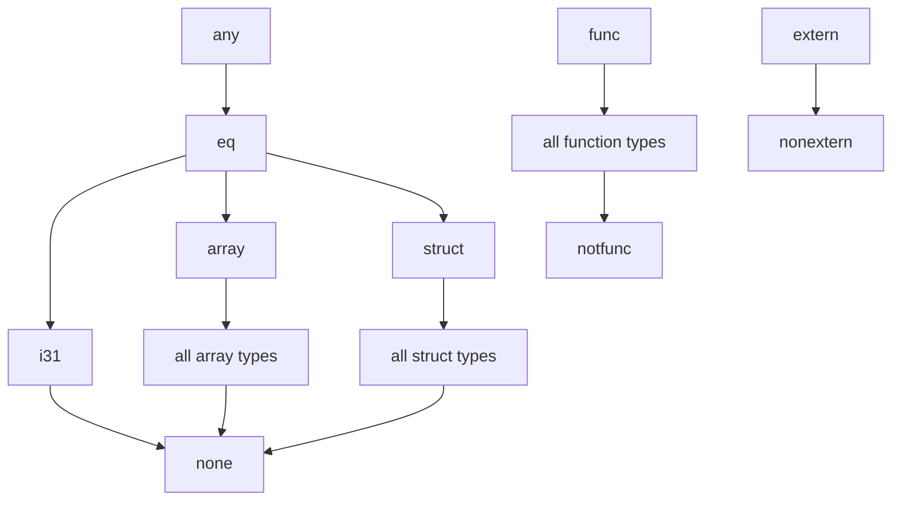

[WebAssembly Advent Calendar 2023](https://qiita.com/advent-calendar/2023/webassembly) 8日目の記事です。ScalaのWASM対応をしたいな〜と思っていて以前 [Scala.js + Javy で Scala を WebAssembly 上で動かす](https://zenn.dev/tanishiking/articles/scala-wasm-javy) という記事を書きました。

しかし、Scalaから生成されるWASMのバイナリサイズを削減するため、実用的なGC実装を自分で実装するのイヤんだな〜という気持ちからゆくゆくはWasmGCにコンパイルしたい！

WasmGCの概要や嬉しみは以下の記事がわかりやすいのですが

https://v8.dev/blog/wasm-gc-porting

https://zenn.dev/askua/articles/afe3a3b43b82cb

この記事では具体的にどういう型や命令がこのproposalで追加されるのかを見ていきます。

## Reference Types
[Typed Function References](https://github.com/WebAssembly/gc/blob/main/proposals/function-references/Overview.md) によって導入される型

([reference type proposal](https://github.com/WebAssembly/gc/blob/main/proposals/reference-types/Overview.md) で導入された `extern` と `func` は後述)


`(ref null? <heap-type>)`

```wasm
(type $A (struct)) ;; index = 0
(func $f1 (param (ref null $A))) ;; func f1(a *A) { ... }
(func $f2 (result (ref 0)))) ;; func f2() *A { ... }
```

`(ref null <heap-type>)` だと nullable

## Heap Types

wasm gc proposal による wasm に stack, linear memory に加えて heap が追加される(追加されるというか "[The introduction of managed data adds new forms of types that describe the layout of memory blocks on the heap](https://github.com/WebAssembly/gc/blob/main/proposals/gc/Overview.md#types)" で wasm実行エンジンにheapが必要になってくるという言い方のほうが正しいのかな)

### Structures

```wasm
(type $time (struct (field i32) (field f64)))
(type $point (struct (field $x f64) (field $y f64) (field $z f64)))
```

- `structtype ::= struct <fieldtype>*`
- `fieldtype ::= <mutability> <storagetype>`
- ...

現行のwasm spec見ても `mutability` や field に名前つけられる?ようなWAT文法の仕様見つけられなかったんだけど、 `(field mut? <field-name>? <storagetype>)` って感じかな?

### Array

```wasm
(type $vector (array (mut f64)))
(type $matrix (array (mut (ref $vector))))
```

structures とあんまり変わらない `arraytype ::= array <fieldtype>`

### Recursive types

`rec` によって相互再帰している型を定義できるし、単一の型定義でも再帰的な定義ができるようになる。

```wasm
(rec
  (type $A (struct (field $b (ref null $B))))
  (type B$ (struct (field $a (ref null $A))))
)
(type $C (struct field $f i32) (field $c (ref null $C)))
```

### Unboxed Scalars

`i31` https://github.com/WebAssembly/gc/blob/main/proposals/gc/Overview.md#unboxed-scalars

`i32`のような数値型も他のheap型と同様に扱うためにそれらの型はboxingされることになる。アクセス頻度の高いpremitive typesのboxing costを避けるために、導入されるのが unboxed scalars.

32bitの数値をboxingする代わりに、31bitに実際の値を格納し、残りの1bitに"僕ポインタじゃないよ！残りの31bitに値が入ってるからそのまま使っていいよ"ということを表すフラグを設けるというもの。これにより31bit数値型をboxingコストなしで他のreference typeと同様に利用することができる

(という理解)

https://stackoverflow.com/questions/77468063/why-do-we-need-the-type-of-i31-in-wasmgc-proposal

https://rust-hosted-langs.github.io/book/chapter-interp-tagged-ptrs.html


### External Types

ホストにおける参照/関数をWASM内で `externref/funcref` という型として扱うことができる。以下の `hello` 関数は `externref` 型のパラメータを受け取ることができて、例えばホスト側のJSコードは `hello` に対してJS内の参照を引数として与えることができる。

```wasm
(func (export "hello") (param externref) ...)
```

以下の記事がとてもわかりやすかった

https://zenn.dev/igrep/articles/2021-11-wasm-reference-types

https://bytecodealliance.org/articles/reference-types-in-wasmtime

関連して [type imports proposal](https://github.com/WebAssembly/proposal-type-imports/blob/main/proposals/type-imports/Overview.md) がある


## Type Hierarchy

heapに配置されるデータレイアウトを表現する構造(Heap Types)は以下の三種類に分類される

- Internal (values in Wasm representation)
- External (values in a host-specific representation)
- Functions

そしてそれぞれにtype hierarchyがあり

- `eq` は `ref.eq` による比較が可能なすべての reference types の共通する super type
- `any` は intern types にの top型
- `none` は internal types の bottom型
- `noextern` は external types の bottom型
- `nofunc` は function types の bottom型
- `struct` はすべての struct types の super type
- `array` はすべての array types の super type
- `i31` は unboxed scalars

まとめると



## Subtypes

```wasm
(type $A (struct)) ;; これは `(type $A (sub (struct)))` の省略形
(type $A (sub (struct))) ;; class A {}
 ;; i32 の field を持ち A の subtype である B を定義
(type $B (sub $A (struct (field i32))))
 ;; i32 と i64 の fields を持ち B の subtype である C を定義
(type $C (sub final $B (struct (field i32 i64))))
```

> the preexisting syntax with no sub clause is redefined to be a shorthand for a sub clause with empty typeidx list


## Abbreviations

```
funcref == (ref null func)
externref == (ref null extern)
anyref == (ref null any)
nullref == (ref null none)
nullexternref == (ref null noextern)
nullfuncref == (ref null nofunc)
eqref == (ref null eq)
structref == (ref null struct)
arrayref == (ref null array)
i31ref == (ref null i31)
```

## New instructions
### `i31.*`
`i31.get_u` や `i31.get_s` (get_u/s が 符号拡張あり/なし)


### `array.*` と `struct.*`
- `array.new`, `struct.new`
- `array.get/set`, `struct.get/set`
- `array.len/fill/copy`

```wasm
(type $vector (array (mut f64)))
(type $tup (struct i64 i64 i32))

;; array.new <type> <values>
;; struct.new <type> <values>
(local.set $v (array.new $vector (f64.const 1) (i32.const 3)))
(local.set $t (struct.new $tup (i64.const 1) (i64.const 2) (i64.const 1)))

;; array.get <type> <arrayref> <index>
;; struct.get <type> <index> <structref>
(array.get $vector (local.get $v) (i32.const 1)) ;; $v の 1番目の要素を取得 (0-index)
(struct.get $tup 1 (local.get $t)) ;; $t の1番目の要素を取得

;; array.set <type> <arrayref> <index> <value>
;; struct.set <type> <index> <sturctref> <value>
(array.set $vector (local.get $v) (i32.const 2) (i32.const 5)) ;; $v の2番目の要素に5をset
(struct.set $tup 1 (local.get $t) (i64.const 100)) ;; $t の1番目のフィールドに100をセット
```

その他の `array.*` は [MVP](https://github.com/WebAssembly/gc/blob/main/proposals/gc/MVP.md#arrays) (new_defaultとかあまり分かってない...) 

### `br_on_*` 
reference type の値に応じた branching

- `br_on_cast`
  - > (br_on_cast $label <value> <rtt>)
  - 第2引数valueのruntime typeがrtt に castできるのであれば、rtt に cast した value を引数として `$label` に分岐する (stackにpushしてジャンプ?)
- `br_on_cast_fail`
  - `(br>on_cast_fail $label <value> <rtt>)`
  - value が rtt に cast できなかった場合、value を引数として `$label` に分岐する(?)
- `br_on_null $l <value>`
  - `(br_on_null $l (local.get $r))` `$r` が null reference なら `$l` に分岐。`$r` を stack に push するのか?
- `br_on_non_null $l`


### `ref.*`
casting and testing values of reference types

- `ref.null ht` - `ht` 型の null reference を作る `(ref.null eq)`
- `ref.i31 $x` - `$x: i32` から `i31ref` をつくる `(ref.i31 1)`
- `ref.test <ref ht> <runtime-type>`
 - 第一引数のreferenceを第二引数のruntime-typeにcastできるか調べる。できるなら1、できないなら0
- `ref.cast <ref ht> <runtime-type>`
  - 第一引数のreferenceを第二引数のruntime-typeにcast
  - castできない場合はtrap
- `ref.is_null <ref ht>`
  - 与えた reference が null なら 1、そうでないなら0
- `ref.as_non_null <ref null ht>` - nullable な reference を non-nullable にする? よく分かってない
- `ref.eq <ref ht> <ref ht>` 2つの `eqref` な operand を受け取って、ふたつの参照の値の同一性チェックを行う。(具体的な同一性チェックの話は見つけられてない)
- `ref.func` - function を引数にして function reference を作る

### `extern.*`
"converts an external value into the internal representation" とかその逆とか書いてるけどよく分かってない

- `extern.convert_any`
- `any.convert_extern`

## wasmgcのwatとwasmを相互変換したり実行したり

https://github.com/tanishiking/waml-docker

wasmgc の reference interpreter や toy language である waml をシュッと実行するための Docker ファイルを書いた。

```docker
FROM ocaml/opam:debian-ocaml-4.12

RUN git clone -b waml https://github.com/WebAssembly/gc.git
RUN opam install dune
RUN eval $(opam env) && \
    cd gc/interpreter && \
    make && \
    make install
RUN eval $(opam env) && \
    cd gc/proposals/gc/waml && \
    make
ENV PATH $PATH:$HOME/gc/interpreter
ENV PATH $PATH:$HOME/gc/proposals/gc/waml
```

```sh
$ docker build . -t waml
$ docker run -it waml waml -x -c
waml 0.2 interpreter
> val f x = x + 7;  f 5;
...

# compile waml to wasm
$ docker run -i -v "$PWD":/data waml waml -c /data/test.waml

# compile waml to wat
$ docker run -i -v "$PWD":/data waml waml -c -x /data/test.waml

# convert wat to wasm
$ docker run -i -v "$PWD":/data waml wasm -d /data/test.wat -o /data/test.wasm

# interpret wasm
$ docker run -i -v "$PWD":/data waml wasm /data/test.wasm
```

### wasm reference interpreter

WebAssembly spec の `/interpreter` に wasm reference interpreter があり、`WebAssembly/gc` だと wasm gc 対応の reference interpreter が使えます。これを使って wasmgc の text format と binary format の変換をしたり、実行したりすると良さそう。V8もデフォルトでwasmgc実行できるようになったので DenoやらNodeやらブラウザから実行しても良いだろう。

https://github.com/WebAssembly/gc/tree/main/interpreter

### waml

https://github.com/WebAssembly/gc/tree/waml/proposals/gc/waml

> An experimental functional language and implementation for exploring and evaluating the Wasm GC proposal.

なる wasm にコンパイルできるミニML言語もある。これを使って、どういうコードがどういうwasmgcコードに変換されるべきかを眺めるのも良い勉強になる。

## 参考
- [gc/proposals/gc/Overview.md at main · WebAssembly/gc](https://github.com/WebAssembly/gc/blob/main/proposals/gc/Overview.md)
- [gc/proposals/gc/MVP.md at main · WebAssembly/gc](https://github.com/WebAssembly/gc/blob/main/proposals/gc/MVP.md)
- [A new way to bring garbage collected programming languages efficiently to WebAssembly · V8](https://v8.dev/blog/wasm-gc-porting)
- [Wasm GC: What Exactly Is It (and Why I Should Care) - Ivan Mikushin, VMware - YouTube](https://www.youtube.com/watch?v=ndJP-vmZFYk)
- [WasmGCについて予習する](https://zenn.dev/askua/articles/afe3a3b43b82cb)
- [webassembly - Why do we need the type of i31 in WasmGC proposal? - Stack Overflow](https://stackoverflow.com/questions/77468063/why-do-we-need-the-type-of-i31-in-wasmgc-proposal)
- [Bytecode Alliance — WebAssembly Reference Types in Wasmtime](https://bytecodealliance.org/articles/reference-types-in-wasmtime)
- [WebAssembly Reference Typesで、WasmでDOMを操作する壁がここまで下がった](https://zenn.dev/igrep/articles/2021-11-wasm-reference-types)